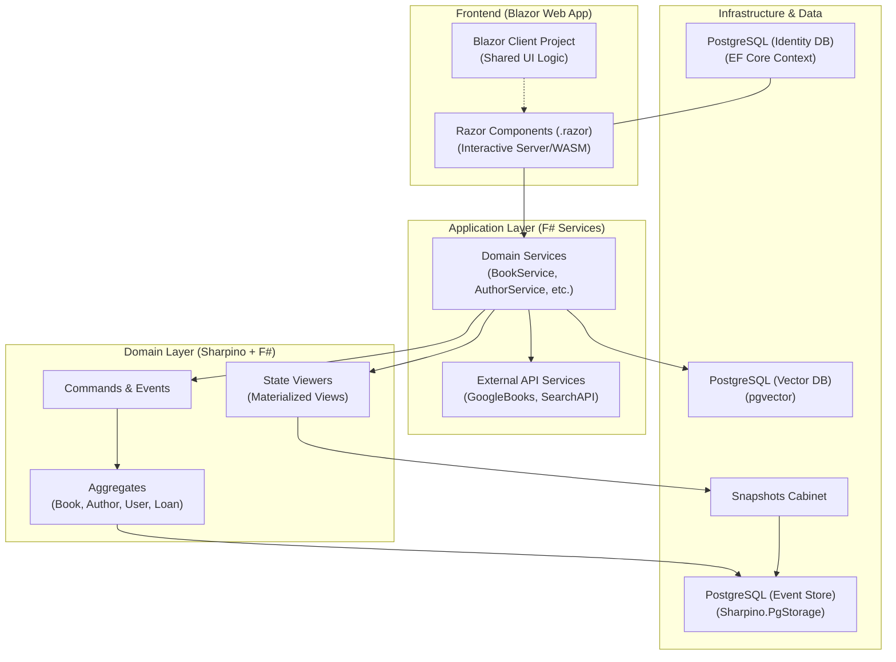

# Architecture Overview: Blazor Book Library

The Blazor Book Library is a modern web application built with a clear separation of concerns, leveraging **Blazor** for a dynamic frontend and **F# with Event Sourcing (Sharpino)** for a robust, traceable backend.

## Architectural Layers

---

## Component Breakdown

### 1. Presentation Layer (Blazor)
- **Interactive Modes**: Supports both `InteractiveServer` (hosting on the server) and `InteractiveWebAssembly` (client-side execution) for optimal user experience.
- **UI Components**: Uses `QuickGrid` for data density and performance, and custom components like `BookSearchToolbar` for complex filtering.
- **Barcode Integration**: Utilizes JS-interop with `ZXing` for real-time ISBN scanning via device cameras.

### 2. Application & Domain Layer (F# / Sharpino)
- **CQRS Pattern**: Decouples write operations (Commands) from read operations (Viewers/Queries).
- **Event Sourcing**: Instead of storing the current state, the system stores the **sequence of events** that led to that state. This provides a full audit trail and the ability to rebuild state at any point in time.
- **Sharpino Integration**: A specialized library that handles the heavy lifting of event persistence, aggregate execution, and state caching.

### 3. Service Layer
- **Domain Services**: Thin wrappers in F# that orchestrate command execution and state retrieval.
- **External Services**: Integrates with the **Google Books API** to enrich local data with global metadata.

### 4. Data Persistence
- **Dual Database Strategy**:
    - **Identity DB**: Uses standard SQL (via EF Core) to manage ASP.NET Identity users, roles, and security tokens.
    - **Event Store**: Uses PostgreSQL to persist JSON-serialized events and snapshots, ensuring high consistency and scalability.
    - **Vector Database**: A specialized PostgreSQL projection utilizing the **pgvector** extension. It stores high-dimensional embeddings of book descriptions to enable semantic similarity searches.

### 5. Security & Infrastructure
- **Identity & OAuth**: Integrated with Microsoft Identity and Google OAuth for secure authentication.
- **Bot Protection**: Implements `Recaptcha v3` and a custom `BotScoreService` to mitigate automated abuse.
- **Localization**: Full support for `it-IT` and `en-US` via standard .NET localization patterns (`IStringLocalizer`).

### 6. GDPR & Anonymization (Ghosting Pattern)
- **Anonymization Strategy**: To honor GDPR "Right to be Forgotten" while maintaining event stream integrity, the system implements a "Ghosting" pattern.
- **Identity Anonymization**: The ASP.NET Identity record is anonymized (email/username randomized, personal fields cleared) and permanently disabled.
- **Event Integrity**: The underlying F# aggregates (e.g., `User`) remain resolvable by their IDs, ensuring that historical records like loans or reservations don't "break" when a user departs.
