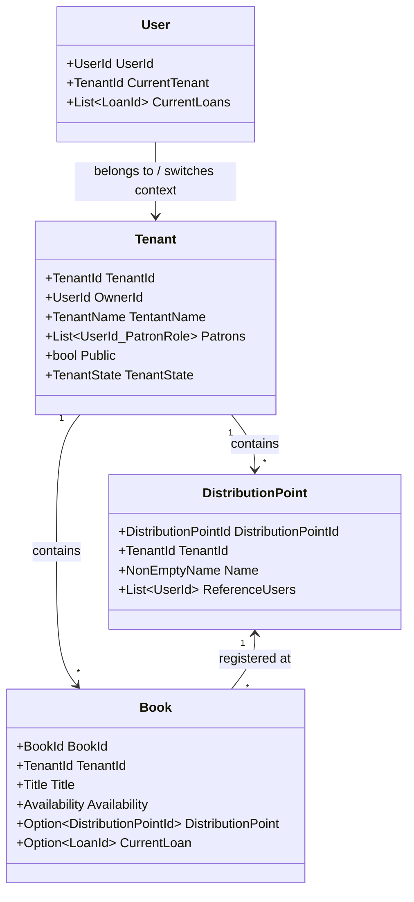

# Multi-Tenancy (Circuits) Architecture & Features: Blazor Book Library

This document provides a comprehensive functional and architectural overview of the **Multi-Tenancy (Circuits)** feature in the **Blazor Book Library**. It details the user autonomy model, operational modes, role delegation, data isolation boundaries, and technical models.

---

## 🚀 1. Overview & Core Philosophy

The Blazor Book Library is designed with a decentralized, self-governing **Multi-Tenant (Circuit)** architecture. Rather than relying on a single, global database where all users see the same records, the system is organized into distinct, isolated lending ecosystems called **Circuits** (or **Tenants**). This architecture serves two distinct audiences: standard users looking to participate in a shared catalog, and community builders or book collectors who want to run their own independent lending services.

### 👥 The "Default" vs. "Autonomous" Tenant Experience
1. **The Demonstration Circuit (Default Tenant)**: By default, any newly registered user automatically joins and browses the **Default Tenant** (`TenantId.Default`). 
   * This circuit acts as a sandbox, public playground, and demonstration environment.
   * What has been established in terms of catalogs, public book lists, common categories, and illustrative distribution points remains completely active, accessible, and valid within this default context.
   * It ensures immediate, zero-friction access for newcomers to explore the standard features of the application.
2. **Autonomous Circuits (Library-as-a-Service)**: The true innovation of the platform lies in user-driven multi-tenant autonomy. **Any authenticated user can instantly spin up their own Tenant (Circuit) at any time**. 
   * Spinning up a new circuit creates a fully isolated universe (an independent "Tenant instance").
   * The creator becomes the absolute **Owner** of this new circuit, operating the solution as a lightweight, cloud-ready service.
   * Inside their custom circuit, owners have complete administrative control to define a custom list of [Book](file:///Users/antoniolucca/github/blazorBookLibrary/blazorBookLibrary.Shared/Domain/Book.fs#L9-L32) records, [AuthorId](file:///Users/antoniolucca/github/blazorBookLibrary/blazorBookLibrary.Shared/Commons.fs#L383-L390) entries, and [DistributionPoint](file:///Users/antoniolucca/github/blazorBookLibrary/blazorBookLibrary.Shared/Domain/DistributionPoint.fs#L10-L16) markers.
   * Owners can invite their own **Patrons**, designate **Managers**, and configure access policies (Public or Private) without interfering with the default sandbox or other active tenants.

---

## 🛠️ 2. Key Operational Models

Tenants are highly configurable, enabling users to organize their book-lending systems around their unique structural and social needs.

````carousel
### 🔒 Model A: Closed & Private Sharing Circle
*   **Target Audience**: Personal book collectors, small clubs, or circles of friends.
*   **Privacy Setting**: Private (Virtually invisible to outsiders).
*   **Access Control**: Strictly invitation/join-by-request.
*   **Goal**: Create a unique shared archive from the books of multiple users, coordinating pick-ups and drop-offs within a trusted circle without letting the general public browse or search the catalog.
<!-- slide -->
### 🏛️ Model B: Public / Community Library
*   **Target Audience**: Neighborhood book-swaps, school libraries, or small public entities.
*   **Privacy Setting**: Public (Visible and searchable by the public).
*   **Access Control**: Auto-accept members or open join.
*   **Goal**: Serve a wider audience, enabling anyone to discover books, view location details, and request loans, bringing accessibility to physical communities.
<!-- slide -->
### 📝 Model C: Personal Cataloging & Data Export
*   **Target Audience**: Solo collectors organizing their own private physical shelves.
*   **Privacy Setting**: Closed / Strictly Private.
*   **Access Control**: Owner-only.
*   **Goal**: Catalog personal archives. Users can maintain digital metadata, track reading history, and export data dynamically into **CSV** or **JSON** formats to print physical copies or import them into external management software.
````

---

## 👥 3. Administrative Roles & Authority

Every tenant specifies a clear authority model managed through functional roles.

| Role | Scope | Key Capabilities | Code Symbol |
| :--- | :--- | :--- | :--- |
| **Owner** | Administrative / Tenant Creator | Absolute management: add/remove patrons, promote/demote managers, set public/private status, deactivate tenant. | [OwnerId](file:///Users/antoniolucca/github/blazorBookLibrary/blazorBookLibrary.Shared/Domain/Tenant.fs#L13) |
| **Manager** | Operational Library Lead | Manage the catalog (add/edit books, register authors), verify book conditions, manage distribution points, review statistics. | [Manager](file:///Users/antoniolucca/github/blazorBookLibrary/blazorBookLibrary.Shared/Domain/Tenant.fs#L9) |
| **User (Patron)** | General Reader / Borrower | Browse catalog, request loans, submit reviews, make reservations. | [User](file:///Users/antoniolucca/github/blazorBookLibrary/blazorBookLibrary.Shared/Domain/Tenant.fs#L10) |
| **Reference User** | Distribution Point Custodian | Verify physical pick-ups and returns, acting as the authority for a specific location. | [ReferenceUsers](file:///Users/antoniolucca/github/blazorBookLibrary/blazorBookLibrary.Shared/Domain/DistributionPoint.fs#L15) |

### 📍 Distribution Point Custody & Self-Service
*   **Delegated Custody**: By default, managers delegate individuals to act as **Reference Users** for physical [DistributionPoint](file:///Users/antoniolucca/github/blazorBookLibrary/blazorBookLibrary.Shared/Domain/DistributionPoint.fs#L10-L16) locations. These custodians verify that a book was actually handed over or returned safely before updating the transaction status.
*   **Self-Service Tracking (Trust-Based)**: Alternatively, a circuit owner can choose to adopt a self-service model. By eliminating tracking authorities, the circuit relies entirely on **trust, self-discipline, and honesty**. Patrons directly log their own borrows and returns, which is ideal for tight-knit friend circles or shared office shelves.

---

## 🔄 4. Circulation Rules: Today and Tomorrow

Managing where books belong and how they move through physical distribution points is crucial to inventory integrity.

> [!IMPORTANT]
> **Current Return Constraint**: Books *must* be returned to the exact physical [DistributionPoint](file:///Users/antoniolucca/github/blazorBookLibrary/blazorBookLibrary.Shared/Domain/DistributionPoint.fs#L10-L16) from which they were borrowed or to which they are registered. This ensures physical inventory integrity for multi-user catalogs.

> [!TIP]
> **Roadmap Expansion (Cross-Circulation)**: In future releases, circuit administrators will be able to enable **Cross-Circulation**. This configuration will allow books to circulate freely across any distribution point in the tenant. A borrower can pick up a book at *Point A* and return it to *Point B*, with the system automatically updating the book's current physical location registry.

---

## 🏗️ 5. Domain Models & Architecture

The F# domain core leverages immutable event-sourced state (powered by Sharpino) to enforce tenant boundaries strictly.



### 🔗 Key F# Core Entities & Interfaces

*   **[Tenant](file:///Users/antoniolucca/github/blazorBookLibrary/blazorBookLibrary.Shared/Domain/Tenant.fs#L12-L21)**: The core multi-tenancy boundary containing metadata, status (Active/Deactivated), visibility (Public/Private), and the roster of patrons.
*   **[TenantId](file:///Users/antoniolucca/github/blazorBookLibrary/blazorBookLibrary.Shared/Commons.fs#L79-L86)**: The unique identifier. Defines `TenantId.Default` for the demonstration circuit.
*   **[DistributionPoint](file:///Users/antoniolucca/github/blazorBookLibrary/blazorBookLibrary.Shared/Domain/DistributionPoint.fs#L10-L16)**: Represents a physical library branch or pick-up locker associated with a single [TenantId](file:///Users/antoniolucca/github/blazorBookLibrary/blazorBookLibrary.Shared/Commons.fs#L79-L86).
*   **[Book](file:///Users/antoniolucca/github/blazorBookLibrary/blazorBookLibrary.Shared/Domain/Book.fs#L9-L32)**: Isolated records belonging to a tenant, containing an optional reference to a [DistributionPointId](file:///Users/antoniolucca/github/blazorBookLibrary/blazorBookLibrary.Shared/Commons.fs#L62-L69).
*   **[ITenantService](file:///Users/antoniolucca/github/blazorBookLibrary/blazorBookLibrary.Shared/Services/ITenantService.fs#L10)**: The service layer executing commands like creating tenants, promoting patrons, or setting privacy toggles.
*   **[IUserTenantResolverService](file:///Users/antoniolucca/github/blazorBookLibrary/blazorBookLibrary.Shared/Services/IUserTenantResolverService.fs#L13)**: Dynamically resolves which [TenantId](file:///Users/antoniolucca/github/blazorBookLibrary/blazorBookLibrary.Shared/Commons.fs#L79-L86) represents the current viewing context for a given [UserContext](file:///Users/antoniolucca/github/blazorBookLibrary/blazorBookLibrary.Shared/Commons.fs#L514-L543).

---

## 🌍 6. Software-as-a-Service (SaaS) & Community Bookcrossing Value

The multi-tenant framework transforms the Blazor Book Library from a simple single-site inventory list into an **elastic, cloud-native Software-as-a-Service (SaaS) platform** that empowers any local group, bookcrossing circuit, school, or individual collector to unlock their library's value.

### 📚 Low-Effort Community Bookcrossing & Cataloging
* **Unleashing Catalog Value**: Creating book metadata is incredibly low effort. Once a tenant is spun up, cataloging books, configuring categories, and tracking book conditions is immediate. This makes it trivial for anyone to share catalogs.
* **Bookcrossing Circuits**: Users can establish a local "Bookcrossing Circuit" in their town or neighborhood. By configuring the circuit as **Public**, anyone in the vicinity can discover available books, learn where the physical distribution boxes or cafés are located, and easily participate in community-driven sharing.

### ✉️ The Patron Invitation & Onboarding Workflow
Onboarding members to an autonomous circuit is completely seamless and automated:
1. **Invite Patrons**: A circuit Owner/Manager invites a user by specifying their email address.
2. **Dynamic Invitation Email**: The system generates a secure, unique `PatronInvitationCode` and constructs a personalized invitation link:
   `{HostAddress}/Account/AcceptInvitation?tenantId={TenantId}&code={PatronInvitationCode}`
   * This URL format is fully independent of hosting configurations, dynamically falling back to local configurations in developmental environments.
3. **Low-Friction Joining**: When the invitee clicks the link:
   * The application ensures they are authenticated (guiding them safely through login/registration if necessary).
   * It completes the backend aggregate conversion to transform them into a registered **Patron** of that specific tenant.
   * It instantly updates their active tenant context (`UserService.SetCurrentTenantAsync`) and sets a secure browser cookie (`selected_tenant`).
   * The new patron is instantly redirected to their new personalized library dashboard.

---

## 📈 7. Summary of Multi-Tenant Benefits
*   **Absolute Tenant Isolation**: Complete data privacy for custom libraries, families, or private reading groups who do not wish to expose their shared collections.
*   **Low-Overhead Community SaaS**: Empowers any hobbyist, community organizer, or bookcrossing advocate to immediately act as a digital librarian with zero setup or hosting overhead.
*   **Demonstration Sandbox Continuity**: The default sandbox (`TenantId.Default`) remains fully available and active, guaranteeing a safe, ready-to-use exploration space for all newly registered users without cluttering private autonomous circuits.
*   **Data Portability**: Clean pathways to catalogue privately and export files safely as CSV/JSON for legacy printing, inventory tracking, or migration.

