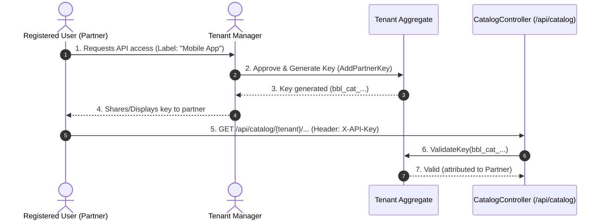

```mermaid

sequenceDiagram
    autonumber
    actor Partner as Registered User (Partner)
    actor Manager as Tenant Manager
    participant Tenant as Tenant Aggregate
    participant Controller as CatalogController (/api/catalog)

    Partner->>Manager: 1. Requests API access (Label: "Mobile App")
    Manager->>Tenant: 2. Approve & Generate Key (AddPartnerKey)
    Tenant-->>Manager: 3. Key generated (bbl_cat_...)
    Manager-->>Partner: 4. Shares/Displays key to partner
    Partner->>Controller: 5. GET /api/catalog/{tenant}/... (Header: X-API-Key)
    Controller->>Tenant: 6. ValidateKey(bbl_cat_...)
    Tenant-->>Controller: 7. Valid (attributed to Partner)
```